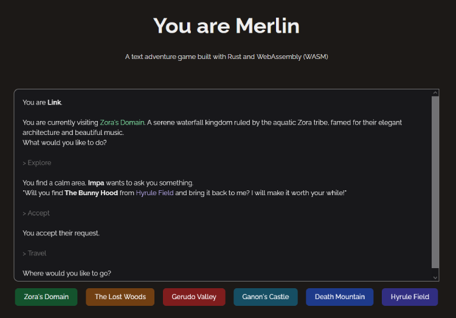

# You are Merlin (WASM)

A text adventure game, built with Rust. This is the WebAssembly (WASM) version built with React, TypeScript etc etc.

Demo: [https://hseager.github.io/you-are-merlin-www/](https://hseager.github.io/you-are-merlin-www/)

[Click here for the Rust project and CLI version](https://github.com/hseager/you-are-merlin)

## Game Features

- Main quest with a final world boss, try to beat them!
- Different Themes
- Side quests
- Items
- Battles
- Recovery

## Dev setup

- run `bun run dev` in root

## Update WASM pack

- Run `wasm-pack build` in the you-are-merlin project
- Copy generated pkg folder to /src/pkg
