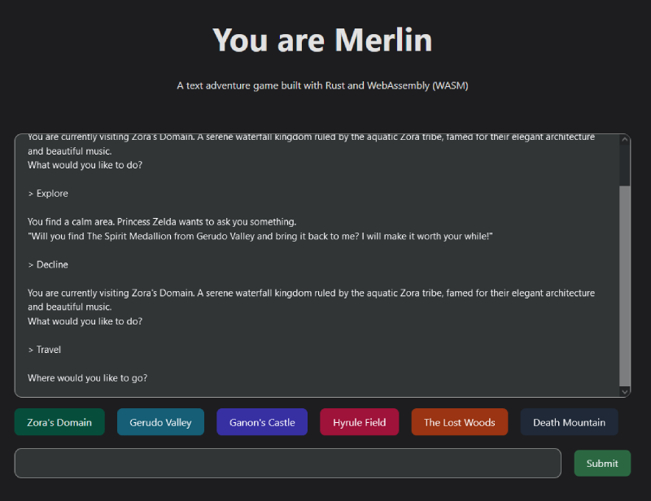

# You are Merlin (WASM)

A text adventure game, built with Rust. This is the WebAssembly (WASM) version.

[Click here for the Rust project and CLI version](https://github.com/hseager/you-are-merlin)

## Dev setup

- Run `wasm-pack build` in the you-are-merlin project
- Copy generated pkg folder to /src/pkg
- run `bun run dev` in root
